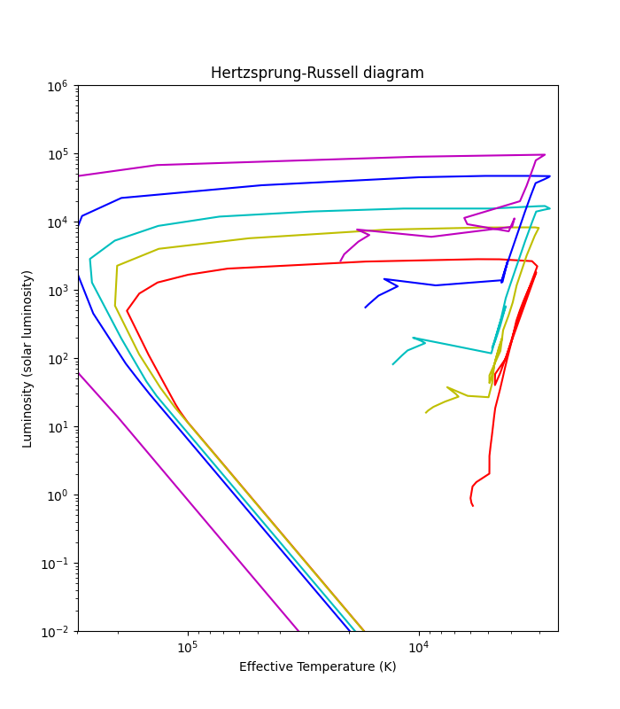

reduce stellar evolution to a PNG picture
-----------------------------------------

Small experiment in compressing the information of stellar evolution
codes. The png is a nice visual representation of stellar evolution,
and can be used to derive star evolution tracks! ;-)

256x256 pixels: 

32x32 pixels: 

32x32 HR: 
